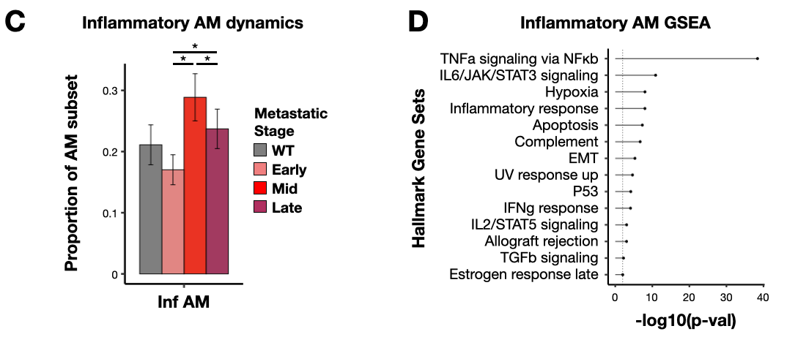

Github repo hosting companion code for "The temporal progression of lung immune remodeling during breast cancer metastasis" (McGinnis et al, 2024, Cancer Cell)

Materials include (1) .Robj files for each figure available for download at synapse (www.synapse.org/#!Synapse:syn55388137) and (2) .R files containing custom scripts to reproduce all main text and supplemental figures. 

## Main Text Figures 

Figure 1: Longitudinal scRNA-seq cell atlas of PyMT mouse lung immune cells captures dynamics of the metastatic microenvironment.
- seu_imm_fin_2.Robj - Seurat object of full PyMT longitudinal atlas
- immune_markers.Robj - List of marker genes used to generate cell type annotation dot plot
- jsd_imm.Robj - Jensen-shannon divergence matrix
- anno_freq_summary_imm.Robj - Immune cell type proportion table
- prop_test_imm.Robj - Results of propeller test for significant shifts in immune cell type proportions

Figure 2: AM inflammation and IM wound healing transcriptional signatures are linked to pre-metastatic niche formation.
- seu_int.Robj - Seurat object of IMs in PyMT longitudinal atlas
- seu_alv.Robj - Seurat object of AMs in PyMT longitudinal atlas
- anno_freq_summary_int.Robj - IM subtype proportion table
- anno_freq_summary_alv.Robj - AM subtype proportion table
- crip1_zscores.Robj - Z-score values for Crip1-high Cav1+ signature genes in IM subypes 
- umap_alv.Robj - UMAP cell embedding for AMs
  

Figure 3: NMF and GSEA links Cd14+ inflammatory AM signature to TLR-NFkB inflammation and CD14+ ‘activated’ MDSCs.
- seu_alv.Robj - Seurat object of AMs in PyMT longitudinal atlas (from Fig 2)
- seu_alv_sub.Robj - Seurat object of subsetted 'lipid', 'allergy', and 'antigen' AMs in PyMT longitudinal atlas
- anno_freq_summary_alv_inf.Robj - Inflammatory AM subtype proportion table
- nmf_alv.Robj - Non-negative matrix factorization results for AMs
- gsea_alv_inf.Robj - Gene set enrichment analysis results for CD14+ TLR-NFkB inflammatory AM signature genes (NMF8)
  

Figure 4: BM-derived myeloid subtype characterization uncovers metastasis-associated DC subtype frequency shifts and TLR-NFkB inflammation in neutrophils.
- seu_mono.Robj - Seurat object of monocytes in PyMT longitudinal atlas
- seu_dc.Robj - Seurat object of DCs in PyMT longitudinal atlas
- seu_neu.Robj - Seurat object of neutrophils in PyMT longitudinal atlas
- seu_neu_mature.Robj - Seurat object of subsetted mature neutrophils in PyMT longitudinal atlas
- anno_freq_summary_mono.Robj - Monocyte subtype proportion table
- anno_freq_summary_dc.Robj - DC subtype proportion table
- anno_freq_summary_neu.Robj - Neutrophil subtype proportion table
- umap_neu_mature.Robj - UMAP cell embedding for mature neutrophils
- mature_neu_zscores.Robj - Z-score values for metastatic stage markers in mature neutrophils

Figure 5: Myeloid TLR-NFkB inflammation signature is detected in PyMT pre-metastatic niche myeloid cells, human metastasis-associated macrophages, and multiple mouse models of metastatic breast cancer.
- seu_mono.Robj - Seurat object of monocytes in PyMT longitudinal atlas (from Fig 4)
- seu_int.Robj - Seurat object of IMs in PyMT longitudinal atlas (from Fig 2)
- seu_mam_sub.Robj - Seurat object of brain MAMs from Gonzalez et al
- nmf_myl.Robj - Non-negative matrix factorization results for myeloid cells
- anno_freq_summary_mono_inf.Robj - Inflammatory monocyte subtype proportion table
- anno_freq_summary_int_inf.Robj - Inflammatory IM subtype proportion table
- gsea_myl_inf.Robj - Gene set enrichment analysis results for CD14+ TLR-NFkB inflammatory myeloid signature genes (NMF19)
- myl_facs_data_summary.Robj - Myeloid CD14 flow data summary for visualizing geometric mean box plots
- myl_facs_data_raw.Robj - Raw myeloid CD14 flow data for visualizing CD14 membrane abundance density plots
- seu_fresh_mono.Robj - Seurat object of monocytes in fresh PyMT validation cohort
- seu_fresh_neu.Robj - Seurat object of neutrophils in fresh PyMT validation cohort
- seu_4t1_mono_fin.Robj - Seurat object of monocytes in 4T1 longitudinal atlas 
- seu_4t1_baso_fin.Robj - Seurat object of basophils in 4T1 longitudinal atlas 

Figure 6: Lymphocyte subtype characterization reveals details of the inflammatory and immunosuppressive lung metastatic microenvironment.
- seu_nk.Robj - Seurat object of NK cells in PyMT longitudinal atlas 
- seu_t.Robj - Seurat object of T cells in PyMT longitudinal atlas 
- seu_b.Robj - Seurat object of B cells in PyMT longitudinal atlas
- seu_nk_kim2020.Robj - Seurat object of NK cells from Kim et al
- anno_freq_summary_nk.Robj - NK cell subtype proportion table
- anno_freq_summary_t.Robj - T cell subtype proportion table
- anno_freq_summary_b.Robj - B cell subtype proportion table
- anno_freq_summary_nk_kim.Robj - Kim et al NK cell subtype proportion table
- nk_facs_data_summary.Robj - NK cell CD11b/CD27 data summary for visualizing NK subtyle proportion box plots
- t_cell_zscores.Robj - Z-score values for functional markers in T cells

Figure 7: Intercellular communication modeling reveals metastasis-associated changes in immune cell signaling network.
- seu_imm_fin_2.Robj - Seurat object of full PyMT longitudinal atlas (from Fig 1)
- seu_int.Robj - Seurat object of IMs in PyMT longitudinal atlas (from Fig 2)
- seu_alv.Robj - Seurat object of AMs in PyMT longitudinal atlas (from Fig 2)
- seu_neu.Robj - Seurat object of neutrophils in PyMT longitudinal atlas (from Fig 4)
- cellchat_list.Robj - List of CellChat objects for each metastatic stage in PyMT longitudinal atlas
- neu_ccl6_deg_table.Robj - Table summarizing differential Ccl6 expression tests for neutrophil subtypes at each metastatic stage
- alv_ccl6_deg_table.Robj - Table summarizing differential Ccl6 expression tests for AM subtypes at each metastatic stage
- int_igf1_deg_table.Robj - Table summarizing differential Igf1 expression tests for Mrc1+ IMs at each metastatic stage

## Supplemental Figures

Figure S1: Summaries of MULTI-seq classification and results for cryopreserved PyMT, fresh PyMT, and 4T1 temporal cell atlas datasets.
- cellcount_table_pymt_cryo.Robj - Cell counts per sample for longitudinal PyMT atlas
- cellcount_table_pymt_fresh.Robj - Cell counts per sample for fresh PyMT validation cohort
- cellcount_table_4t1.Robj - Cell counts per sample for longitudinal 4T1 atlas

Figure S2: PyMT validation cohort analysis.
- seu_imm_fresh.Robj - Seurat object of full fresh PyMT validation cohort data
- anno_freq_summary_imm_cryo_fresh.Robj - Immune cell type proportion table for PyMT validation cohort data
- anno_freq_fresh_vs_cryo.Robj - Immune cell type proportion table comparing PyMT longitudinal atlas and fresh PyMT validation cohort datasets
- qpcr_summary_tit.Robj - qRT-PCR data for PyMT tumor titration experiment
- qpcr_summary_exp.Robj - qRT-PCR data for PyMT validation cohort data
- jsd_imm_fresh.Robj - Jensen-shannon divergence matrix for fresh PyMT validation cohort data

Figure S3. Dot and feature plots for tissue-resident macrophage subtype annotation markers.
- seu_int.Robj - Seurat object of IMs in PyMT longitudinal atlas (from Fig 2)
- seu_alv.Robj - Seurat object of AMs in PyMT longitudinal atlas (from Fig 2)
- int_markers.Robj - List of marker genes used to generate IM subtype annotation dot plot
- alv_markers.Robj - List of marker genes used to generate AM subtype annotation dot plot

Figure S4. Dot and feature plots for bone marrow-derived myeloid subtype annotation markers.
- seu_mono.Robj - Seurat object of monocytes in PyMT longitudinal atlas (from Fig 4)
- seu_dc.Robj - Seurat object of DCs in PyMT longitudinal atlas (from Fig 4)
- seu_neu.Robj - Seurat object of neutrophils in PyMT longitudinal atlas (from Fig 4)
- mono_markers.Robj - List of marker genes used to generate monocyte subtype annotation dot plot
- dc_markers.Robj - List of marker genes used to generate DC subtype annotation dot plot
- neu_markers.Robj - List of marker genes used to generate neutrophil subtype annotation dot plot

Figure S5. Metastatic progression is associated with pathological activation and degranulation gene expression signature in mature neutrophils. 
- seu_fresh_neu_mature.Robj - Seurat object of subsetted mature neutrophils in PyMT validation cohort
- seu_4t1_neu_mature_fin.Robj - Seurat object of subsetted mature neutrophils in 4T1 longitudinal atlas
- mature_neu_4t1_zscores.Robj - Z-score values for metastatic stage markers in mature neutrophils in 4T1 longitudinal atlas
- mature_neu_fresh_zscores.Robj - Z-score values for metastatic stage markers in mature neutrophils in PyMT validation cohort
- umap_neu_mature_fresh.Robj - UMAP cell embedding for mature neutrophils in PyMT validation cohort
- umap_neu_mature_4t1.Robj - UMAP cell embedding for mature neutrophils in 4T1 longitudinal atlas

Figure S6: Cd14+ inflammatory myeloid cells, excluding DCs, express Ccrl2 and are associated with NMF19.
- seu_mono.Robj - Seurat object of monocytes in PyMT longitudinal atlas (from Fig 4)
- seu_dc.Robj - Seurat object of DCs in PyMT longitudinal atlas (from Fig 4)
- seu_neu.Robj - Seurat object of neutrophils in PyMT longitudinal atlas (from Fig 4)
- seu_int.Robj - Seurat object of IMs in PyMT longitudinal atlas (from Fig 2)
- seu_alv.Robj - Seurat object of AMs in PyMT longitudinal atlas (from Fig 2)

Figure S8: Analysis of TLR-NFκB inflammation signature in PyMT validation cohort tissue-resident macrophages.
- seu_fresh_int.Robj - Seurat object of IMs in PyMT validation cohort
- seu_fresh_alv.Robj - Seurat object of AMs in PyMT validation cohort
- anno_freq_summary_alv_inf.Robj - Inflammatory AM subtype proportion table
- anno_freq_summary_int_inf.Robj - Inflammatory IM subtype proportion table

Figure S9: 4T1 longitudinal atlas analysis.
- seu_4t1_imm_fin.Robj - Seurat object of full 4T1 longitudinal atlas
- seu_4t1_int_fin.Robj - Seurat object of IMs in 4T1 longitudinal atlas
- seu_4t1_alv_fin.Robj - Seurat object of AMs in 4T1 longitudinal atlas
- seu_4t1_neu_mature_fin.Robj - Seurat object of subsetted mature neutrophils in 4T1 longitudinal atlas (from Fig S5)
- seu_4t1_baso_fin.Robj - Seurat object of basophils in 4T1 longitudinal atlas (from Fig 5)
- jsd_4t1_sample_all.Robj - Jensen-shannon divergence matrix for full 4T1 longitudinal atlas
- jsd_4t1_sample.Robj - Jensen-shannon divergence matrix for 4T1 longitudinal atlas after removing outgroup samples
- baso_markers.Robj - List of marker genes used to generate basophil subtype annotation dot plot
- umap_baso_4t1.Robj - UMAP cell embedding for basophils
- anno_freq_summary_imm_pymt_4t1.Robj - Immune cell type proportion table for 4T1 longitudinal atlas
- anno_freq_4t1_vs_pymt.Robj - Immune cell type proportion table comparing PyMT and 4T1 longitudinal atlas datasets
- pt_size_4t1.Robj - Table of primary tumor sizes during 4T1 tumor timecourse
- anno_freq_summary_dc_4t1 - DC subtype proportion table for 4T1 longitudinal atlas

Figure S10. Dot and feature plots for lymphocyte subtype annotation markers.
- seu_t_prolif.Robj - Seurat object of subsetted proliferative T cells from PyMT longitudinal atlas
- seu_nk.Robj - Seurat object of NK cells in PyMT longitudinal atlas (from Fig 6) 
- seu_t.Robj - Seurat object of T cells in PyMT longitudinal atlas (from Fig 6) 
- seu_b.Robj - Seurat object of B cells in PyMT longitudinal atlas (from Fig 6) 
- nk_markers.Robj - List of marker genes used to generate NK subtype annotation dot plot
- t_markers.Robj - List of marker genes used to generate T cell subtype annotation dot plot
- b_markers.Robj - List of marker genes used to generate B cell subtype annotation dot plot
- anno_freq_t_all_vs_prolif.Robj - Proliferative T cell subtype proportion table

Figure S11: Flow cytometry analysis of natural killer cell subtypes during metastatic progression.
- nk_facs_gating.Robj - NK cell CD11b/CD27/Thy1/KLRG1 flow cytomtery data used for density plots in NK subtype gates

Figure S12: Intercellular communication modeling analysis in PyMT longitudinal atlas, 4T1 longitudinal atlas, and PyMT validation cohort datasets.
- seu_imm_fin_2.Robj - Seurat object of full PyMT longitudinal atlas (from Fig 1)
- cellchat_list.Robj - List of CellChat objects for each metastatic stage in PyMT longitudinal atlas (from Fig 7)
- seu_neu.Robj - Seurat object of neutrophils in PyMT longitudinal atlas (from Fig 4)
- seu_alv.Robj - Seurat object of AMs in PyMT longitudinal atlas (from Fig 2)
- seu_fresh_alv.Robj - Seurat object of AMs in PyMT validation cohort (from Fig S8)
- seu_fresh_neu.Robj - Seurat object of neutrophils in fresh PyMT validation cohort (from Fig 5)
- seu_4t1_alv_fin.Robj - Seurat object of AMs in 4T1 longitudinal atlas (from Fig S9)
- seu_4t1_neu_fin.Robj - Seurat object of neutrophils in 4T1 longitudinal atlas (from Fig S5)
- seu_4t1_baso_fin.Robj - Seurat object of basophils in 4T1 longitudinal atlas (from Fig S9)
- alv_fresh_ccl6_deg_table.Robj - Table summarizing differential Ccl6 expression tests for AM subtypes at each metastatic stage in PyMT validation cohort
- neu_fresh_ccl6_deg_table.Robj - Table summarizing differential Ccl6 expression tests for neutrophil subtypes at each metastatic stage in PyMT validation cohort
- alv_4t1_ccl6_deg_table.Robj - Table summarizing differential Ccl6 expression tests for AM subtypes at each metastatic stage in 4T1 longitudinal atlas
- neu_4t1_ccl6_deg_table.Robj -Table summarizing differential Ccl6 expression tests for neutrophil subtypes at each metastatic stage in 4T1 longitudinal atlas

